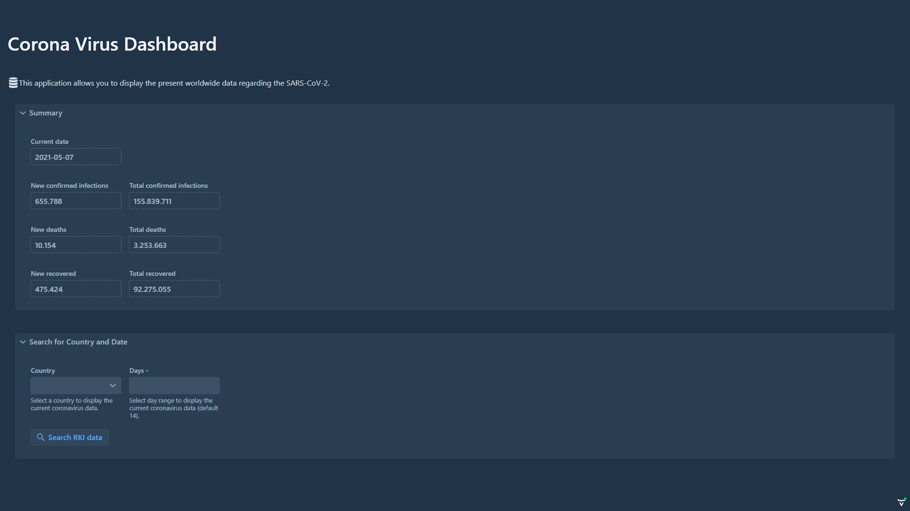

# Corona-RKI
- [**Features**](#features)
- [**Build Instructions**](#build-instructions)

---

Spring and Vaadin Application to display up-to-date infection numbers regarding the coronavirus.

Data retrieved from the [covid19api][1]. For details see the [Postman documentation][2].

## Features
- summary: overview over worldwide data on the present day
    - new/ total confirmed infections
    - new/ total deaths
    - new/ total recovered
- day-one-data: data from the first registered infection to the present day for specific country
- tbc




## Build-Instructions
To build the application, the npm package (package-manager for front-end dependencies) is needed. Otherwise, install it, e.g. on Linux:

```
sudo apt-get install npm
```

To run the application, just execute

```
mvn spring-boot:run
```

[1]: https://api.covid19api.com/
[2]: https://documenter.getpostman.com/view/10808728/SzS8rjbc